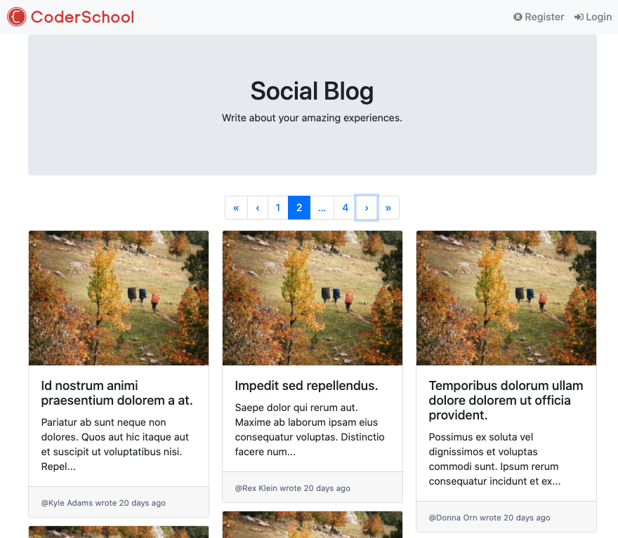

## Get the list of blogs

User can see a list of blogs in the home page.

### Get the data from the backend API

- In `src/redux/constants/blog.constants.js`, add:
  ```javascript
  export const GET_BLOGS_REQUEST = "BLOG.GET_BLOGS_REQUEST";
  export const GET_BLOGS_SUCCESS = "BLOG.GET_BLOGS_SUCCESS";
  export const GET_BLOGS_FAILURE = "BLOG.GET_BLOGS_FAILURE";
  ```

- In `src/redux/actions/blog.actions.js`, add:
  ```javascript
  //...
  const blogsRequest = (pageNum = 1, limit = 10) => async (dispatch) => {
    dispatch({ type: types.GET_BLOGS_REQUEST, payload: null });
    try {
      const res = await api.get(`/blogs?page=${pageNum}&limit=${limit}`);
      dispatch({ type: types.GET_BLOGS_SUCCESS, payload: res.data.data });
    } catch (error) {
      console.log(error)
      dispatch({ type: types.GET_BLOGS_FAILURE, payload: error });
    }
  };

  export const blogActions = {
    blogsRequest,
  };
  ```

- In `src/redux/reducers/blog.reducer.js`, add:
  ```javascript
  //...
  const blogReducer = (state = initialState, action) => {
    const { type, payload } = action;
    switch (type) {
      case types.GET_BLOGS_REQUEST:
        return { ...state, loading: true };
      case types.GET_BLOGS_SUCCESS:
        return {
          ...state,
          blogs: payload.blogs,
          totalPageNum: payload.totalPages,
          loading: false,
        };
      case types.GET_BLOGS_FAILURE:
        return { ...state, loading: false };
      default:
        return state;
    }
  };

  export default blogReducer;
  ```

### Display the data 

Create the stateless components:

- Create `src/components/PaginationBar.js`:
  ```javascript
  import React from "react";
  import { Pagination } from "react-bootstrap";

  const PaginationBar = ({ pageNum, setPageNum, totalPageNum, loading }) => {
    const handleClick = (page) => {
      if (!loading) {
        setPageNum(parseInt(page));
      }
    };

    const handleClickOnFirst = () => {
      if (!loading) {
        setPageNum(1);
      }
    };

    const handleClickOnLast = () => {
      if (!loading) {
        setPageNum(totalPageNum);
      }
    };
    const handleClickOnNext = () => {
      if (pageNum < totalPageNum && !loading) {
        setPageNum((num) => num + 1);
      }
    };
    const handleClickOnPrev = () => {
      if (pageNum > 1 && !loading) {
        setPageNum((num) => num - 1);
      }
    };

    return (
      <Pagination className="justify-content-center" disabled={loading}>
        <Pagination.First disabled={pageNum === 1} onClick={handleClickOnFirst} />
        <Pagination.Prev disabled={pageNum === 1} onClick={handleClickOnPrev} />
        <Pagination.Item active={pageNum === 1} onClick={() => handleClick(1)}>
          {1}
        </Pagination.Item>

        {pageNum - 1 > 1 && <Pagination.Ellipsis />}
        {pageNum > 1 && pageNum < totalPageNum && (
          <Pagination.Item active>{pageNum}</Pagination.Item>
        )}
        {totalPageNum > pageNum + 1 && <Pagination.Ellipsis />}

        {totalPageNum > 1 && (
          <Pagination.Item
            active={pageNum === totalPageNum}
            onClick={() => handleClick(totalPageNum)}
          >
            {totalPageNum}
          </Pagination.Item>
        )}

        <Pagination.Next
          disabled={pageNum === totalPageNum}
          onClick={handleClickOnNext}
        />
        <Pagination.Last
          disabled={pageNum === totalPageNum}
          onClick={handleClickOnLast}
        />
      </Pagination>
    );
  };

  export default PaginationBar;
  ```

- Create `src/components/BlogCard.js`:
  ```javascript
  import React from "react";
  import { Card } from "react-bootstrap";
  import Moment from "react-moment";

  const BlogCard = ({ blog, handleClick }) => {
    return (
      <Card onClick={() => handleClick(blog._id)}>
        <Card.Img
          variant="top"
          src={
            blog?.images?.length
              ? blog.images[0]
              : "https://via.placeholder.com/160x100"
          }
        />
        <Card.Body>
          <Card.Title>{blog.title}</Card.Title>
          <Card.Text>
            {blog.content.length <= 99
              ? blog.content
              : blog.content.slice(0, 99) + "..."}
          </Card.Text>
        </Card.Body>
        <Card.Footer>
          <small className="text-muted">
            <span className="text-muted">
              @{blog?.author?.name} wrote{" "}
              <Moment fromNow>{blog.createdAt}</Moment>
            </span>
          </small>
        </Card.Footer>
      </Card>
    );
  };

  export default BlogCard;
  ```

Finally, put everything together in `HomePage.js`:

- In `HomePage.js`:
  ```javascript
  import BlogCard from "components/BlogCard";
  import PaginationBar from "components/PaginationBar";
  import React, { useEffect, useState } from "react";
  import { CardColumns, Container, Jumbotron } from "react-bootstrap";
  import { useSelector, useDispatch } from "react-redux";
  import { useHistory } from "react-router-dom";
  import { ClipLoader } from "react-spinners";
  import { blogActions } from "redux/actions";

  const HomePage = () => {
    const [pageNum, setPageNum] = useState(1);
    const loading = useSelector((state) => state.blog.loading);
    const blogs = useSelector((state) => state.blog.blogs);
    const totalPageNum = useSelector((state) => state.blog.totalPageNum);
    const dispatch = useDispatch();
    const history = useHistory();

    useEffect(() => {
      dispatch(blogActions.blogsRequest(pageNum));
    }, [dispatch, pageNum]);

    const handleClickOnBlog = (id) => {
      history.push(`/blogs/${id}`);
    };

    return (
      <Container>
        <Jumbotron className="text-center">
          <h1>Social Blog</h1>
          <p>Write about your amazing experiences.</p>
        </Jumbotron>
        <PaginationBar
          pageNum={pageNum}
          setPageNum={setPageNum}
          totalPageNum={totalPageNum}
          loading={loading}
        />
        {loading ? (
          <div className="text-center">
            <ClipLoader color="#f86c6b" size={150} loading={loading} />
          </div>
        ) : (
          <>
            {blogs?.length ? (
              <>
                <CardColumns>
                  {blogs.map((blog) => (
                    <BlogCard
                      blog={blog}
                      key={blog._id}
                      handleClick={handleClickOnBlog}
                    />
                  ))}
                </CardColumns>
              </>
            ) : (
              <p>There are no blogs</p>
            )}
          </>
        )}
      </Container>
    );
  };

  export default HomePage;
  ```

### Evaluation

- You should see the blogs in the home page and the pagination bar should work.

- The loading spinner will be showed when the page is loaded or you change the page num with the pagination bar.



Good job! [Back to instructions](/README.md)