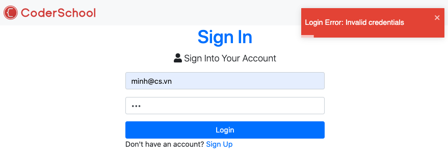
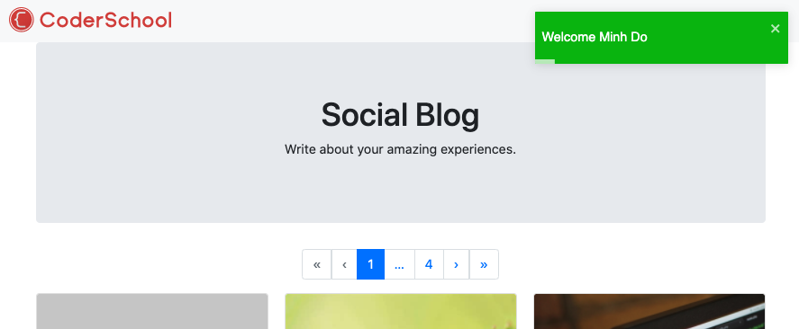

## Authentication - Log in

User can log in with an account.

### Action and reducer

- In `src/redux/constants/auth.constants.js`, add:
  ```javascript
  //...
  export const LOGIN_REQUEST = "AUTH.LOGIN_REQUEST";
  export const LOGIN_SUCCESS = "AUTH.LOGIN_SUCCESS";
  export const LOGIN_FAILURE = "AUTH.LOGIN_FAILURE";
  ```
- In `src/redux/actions/auth.actions.js`, add:
  ```javascript
  //...
  const loginRequest = (email, password) => async (dispatch) => {
    dispatch({ type: types.LOGIN_REQUEST, payload: null });
    try {
      const res = await api.post("/auth/login", { email, password });
      dispatch({ type: types.LOGIN_SUCCESS, payload: res.data.data });
      const name = res.data.data.user.name;
      toast.success(`Welcome ${name}`);
    } catch (error) {
      console.log(error);
      dispatch({ type: types.LOGIN_FAILURE, payload: error });
    }
  };

  export const authActions = {
    register,
    loginRequest,
  };
  ```
- In `src/redux/reducers/auth.reducer.js`, add:
  ```javascript
  const authReducer = (state = initialState, action) => {
    const { type, payload } = action;

    switch (type) {
      //...
      case types.LOGIN_REQUEST:
        return { ...state, loading: true };
      case types.LOGIN_SUCCESS:
        localStorage.setItem("accessToken", payload.accessToken);
        return {
          ...state,
          user: payload.user,
          accessToken: payload.accessToken,
          loading: false,
          isAuthenticated: true,
        };
      case types.LOGIN_FAILURE:
        return { ...state, loading: false, isAuthenticated: false };

      default:
        return state;
    }
  };
  ```

### The GUI 

The login page is pretty similar with the register page.

- In `LoginPage.js`:
```javascript
import React, { useState } from "react";
import { Container, Row, Col, Form, Button } from "react-bootstrap";
import { Redirect, Link } from "react-router-dom";
import { useSelector, useDispatch } from "react-redux";
import { authActions } from "redux/actions";
import { FontAwesomeIcon } from "@fortawesome/react-fontawesome";

const LoginPage = () => {
  const [formData, setFormData] = useState({
    email: "",
    password: "",
  });
  const [errors, setErrors] = useState({
    email: "",
    password: "",
  });
  const dispatch = useDispatch();
  const isAuthenticated = useSelector((state) => state.auth.isAuthenticated);
  const loading = useSelector((state) => state.auth.loading);

  const handleChange = (e) =>
    setFormData({ ...formData, [e.target.name]: e.target.value });

  const handleSubmit = (e) => {
    e.preventDefault();
    const { email, password } = formData;
    if (password.length < 3) {
      setErrors({ ...errors, password: "Password must be longer than 3" });
      return;
    }
    dispatch(authActions.loginRequest(email, password));
  };

  if (isAuthenticated) return <Redirect to="/" />;
  return (
    <Container>
      <Row>
        <Col md={{ span: 6, offset: 3 }}>
          <Form onSubmit={handleSubmit}>
            <div className="text-center mb-3">
              <h1 className="text-primary">Sign In</h1>
              <p className="lead">
                <FontAwesomeIcon icon="user" size="1x" /> Sign Into Your Account
              </p>
            </div>
            <Form.Group>
              <Form.Control
                type="email"
                required
                placeholder="Email Address"
                name="email"
                value={formData.email}
                onChange={handleChange}
              />
              {errors.email && (
                <small className="form-text text-danger">{errors.email}</small>
              )}
            </Form.Group>
            <Form.Group>
              <Form.Control
                type="password"
                placeholder="Password"
                name="password"
                value={formData.password}
                onChange={handleChange}
                minLength="3"
              />
              {errors.password && (
                <small className="form-text text-danger">
                  {errors.password}
                </small>
              )}
            </Form.Group>

            {loading ? (
              <Button
                className="btn-block"
                variant="primary"
                type="button"
                disabled
              >
                <span
                  className="spinner-border spinner-border-sm"
                  role="status"
                  aria-hidden="true"
                ></span>
                Loading...
              </Button>
            ) : (
              <Button className="btn-block" type="submit" variant="primary">
                Login
              </Button>
            )}
            <p>
              Don't have an account? <Link to="/register">Sign Up</Link>
            </p>
          </Form>
        </Col>
      </Row>
    </Container>
  );
};

export default LoginPage;
```

### Evaluation

- If you try to log in with wrong email or password, an error message should pop up.



- After login with the account you have created in previous step, you should be lead to the home page and a welcome message should pop up in the top left corner.



Good job! [Back to instructions](/README.md)