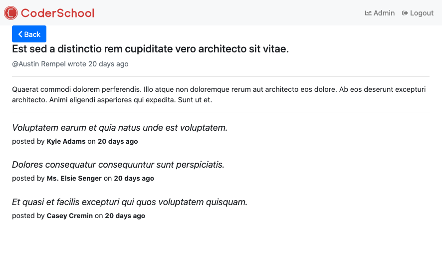

## The Blog Detail Page

In this step, we will implement the blog detail page to show detail of a specific blog that user clicked on. On that page, authenticated user can write review, or interact with emoji icons.

So far you can click on a blog on the home page, and the app will redirect you to a blank page with just a title. Let's start with getting data from the backend API.

### Action and reducer

- In `src/redux/constants/blog.constants.js`, add:
  ```javascript
  //...
  export const GET_SINGLE_BLOG_REQUEST = "BLOG.GET_SINGLE_BLOG_REQUEST";
  export const GET_SINGLE_BLOG_REQUEST_SUCCESS = "BLOG.GET_SINGLE_BLOG_REQUEST_SUCCESS";
  export const GET_SINGLE_BLOG_REQUEST_FAILURE = "BLOG.GET_SINGLE_BLOG_REQUEST_FAILURE";
  ```
- In `src/redux/actions/blog.actions.js`, add:
  ```javascript
  //...
  const getSingleBlog = (blogId) => async (dispatch) => {
    dispatch({ type: types.GET_SINGLE_BLOG_REQUEST, payload: null });
    try {
      const res = await api.get(`/blogs/${blogId}`);
      dispatch({
        type: types.GET_SINGLE_BLOG_REQUEST_SUCCESS,
        payload: res.data.data,
      });
    } catch (error) {
      dispatch({ type: types.GET_SINGLE_BLOG_REQUEST_FAILURE, payload: error });
    }
  };

  export const blogActions = {
    blogsRequest,
    getSingleBlog,
  };
  ```
- In `src/redux/reducers/blog.reducer.js`, add:
  ```javascript
  const blogReducer = (state = initialState, action) => {
    const { type, payload } = action;

    switch (type) {
      //...
      case types.GET_SINGLE_BLOG_REQUEST:
        return { ...state, loading: true };
      case types.GET_SINGLE_BLOG_REQUEST_SUCCESS:
        return { ...state, selectedBlog: payload, loading: false };
      case types.GET_SINGLE_BLOG_REQUEST_FAILURE:
        return { ...state, loading: false };

      default:
        return state;
    }
  };

  export default blogReducer;
  ```

### Integrate with the UI 

- Create `src/components/ReviewList.js`:
  ```javascript
  import React from "react";
  import Moment from "react-moment";

  const ReviewList = ({ reviews }) => {
    return (
      <>
        {reviews?.length > 0 && (
          <ul className="list-unstyled">
            {reviews.map((review) => (
              <ReviewContent key={review._id} review={review} />
            ))}
          </ul>
        )}
      </>
    );
  };

  const ReviewContent = ({ review }) => {
    return (
      <div className="comment">
        <span className="comment_body">{review?.content}</span>
        <br />
        <span className="comment_by">posted by </span>
        <span className="comment_author">{review?.user?.name}</span>
        <span className="comment_on"> on </span>
        <span className="comment_date">
          <Moment fromNow>{review?.createdAt}</Moment>
        </span>
      </div>
    );
  };

  export default ReviewList;
  ```

- In `BlogDetailPage.js`:
  ```javascript
  import React, { useEffect } from "react";
  import { Button } from "react-bootstrap";
  import { useDispatch, useSelector } from "react-redux";
  import { useParams, useHistory, Link } from "react-router-dom";
  import { ClipLoader } from "react-spinners";
  import Moment from "react-moment";
  import Markdown from "react-markdown";
  import { blogActions } from "redux/actions";
  import ReviewList from "components/ReviewList";
  import { FontAwesomeIcon } from "@fortawesome/react-fontawesome";

  const BlogDetailPage = () => {
    const params = useParams();
    const dispatch = useDispatch();
    const blog = useSelector((state) => state.blog.selectedBlog);
    const loading = useSelector((state) => state.blog.loading);
    const currentUser = useSelector((state) => state.auth.user);
    const history = useHistory();

    useEffect(() => {
      if (params?.id) {
        dispatch(blogActions.getSingleBlog(params.id));
      }
    }, [dispatch, params]);

    const handleGoBackClick = (e) => {
      history.goBack();
    };

    return (
      <>
        <div className="d-flex justify-content-between">
          <Button onClick={handleGoBackClick}>
            <FontAwesomeIcon icon="chevron-left" size="1x" /> Back
          </Button>
          {blog?._id && currentUser?._id === blog?.author?._id ? (
            <Link to={`/blog/edit/${blog._id}`}>
              <Button variant="primary">
                <FontAwesomeIcon icon="edit" size="1x" /> Edit
              </Button>
            </Link>
          ) : (
            <></>
          )}
        </div>
        {loading ? (
          <div className="text-center">
            <ClipLoader color="#f86c6b" size={150} loading={loading} />
          </div>
        ) : (
          <>
            {blog && (
              <div className="mb-5">
                <h4>{blog.title}</h4>
                <span className="text-muted">
                  @{blog?.author?.name} wrote{" "}
                  <Moment fromNow>{blog.createdAt}</Moment>
                </span>

                <hr />
                <Markdown source={blog.content} />
                <hr />
                <ReviewList reviews={blog.reviews} />
              </div>
            )}
          </>
        )}
      </>
    );
  };

  export default BlogDetailPage;
  ```

- In `App.css`, add:
  ```css
  .reactions {
    display: flex;
    padding: 0;
  }
  .reactions li {
    list-style: none;
    margin-right: 30px;
    color: #1da1f2;
    font-weight: bold;
  }

  .reactions button {
    border: none;
    color: #657786;
    font-size: 16px;
    cursor: pointer;
  }

  .reactions button:hover {
    color: #1da1f2;
  }

  .comment{
    padding-bottom: 1.5em;
  }
  .comment_body {
    font-size: 20px;
    font-style: italic;
    line-height:1.8;
  }

  .comment_author, .comment_date {
    font-size: 15px;
    font-weight: bold;
  }
  ```

### Evaluation

- You can see the detail info of a blog now including list of reviews.
  

- You can go back to the home page by clicking the `Back` button.

Good job! [Back to instructions](/README.md)