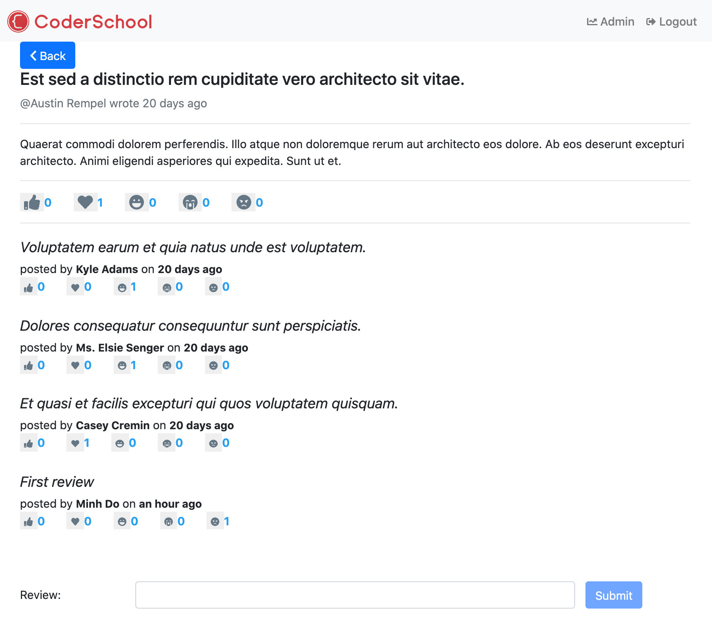

## Emoji reaction

User can react with an emoji (laugh, love, like, sad, or angry) to a review or a blog.

### Action and reducer

- In `src/redux/constants/blog.constants.js`, add:
  ```javascript
  //...
  export const SEND_REACTION_REQUEST = "BLOG.SEND_REACTION_REQUEST";
  export const BLOG_REACTION_SUCCESS = "BLOG.BLOG_REACTION_SUCCESS";
  export const REVIEW_REACTION_SUCCESS = "BLOG.REVIEW_REACTION_SUCCESS";
  export const SEND_REACTION_FAILURE = "BLOG.SEND_REACTION_FAILURE";
  ```
- In `src/redux/actions/blog.actions.js`, add:
  ```javascript
  //...
  const sendEmojiReaction = (targetType, targetId, emoji) => async (dispatch) => {
    dispatch({ type: types.SEND_REACTION_REQUEST, payload: null });
    try {
      const res = await api.post(`/reactions`, { targetType, targetId, emoji });
      if (targetType === "Blog") {
        dispatch({
          type: types.BLOG_REACTION_SUCCESS,
          payload: res.data.data,
        });
      }
      if (targetType === "Review") {
        dispatch({
          type: types.REVIEW_REACTION_SUCCESS,
          payload: { reactions: res.data.data, reviewId: targetId },
        });
      }
    } catch (error) {
      console.log(error);
      dispatch({ type: types.SEND_REACTION_FAILURE, payload: error });
    }
  };

  export const blogActions = {
    blogsRequest,
    getSingleBlog,
    createReview,
    sendEmojiReaction,
  };
  ```
- In `src/redux/reducers/blog.reducer.js`, add:
  ```javascript
  const blogReducer = (state = initialState, action) => {
    const { type, payload } = action;

    switch (type) {
      //...
      case types.SEND_REACTION_REQUEST:
      case types.CREATE_REVIEW_REQUEST:
        return { ...state, submitLoading: true };
      //...

      case types.BLOG_REACTION_SUCCESS:
      return {
        ...state,
        selectedBlog: { ...state.selectedBlog, reactions: payload },
        submitLoading: false,
      };

      case types.REVIEW_REACTION_SUCCESS:
        return {
          ...state,
          selectedBlog: {
            ...state.selectedBlog,
            reviews: [
              ...state.selectedBlog.reviews.map((review) => {
                if (review._id !== payload.reviewId) return review;
                return { ...review, reactions: payload.reactions };
              }),
            ],
          },
          submitLoading: false,
        };

      case types.SEND_REACTION_FAILURE:
      case types.CREATE_REVIEW_FAILURE:
        return { ...state, submitLoading: false };

      default:
        return state;
    }
  };

  export default blogReducer;
  ```

### Integrate with the UI 

- Create `src/components/ReviewList.js`:
  ```javascript
  import React from "react";
  import { FontAwesomeIcon } from "@fortawesome/react-fontawesome";

  const ReactionList = ({
    reactionsData,
    targetType,
    targetId,
    handleEmojiClick,
    loading,
    size,
  }) => {
    return (
      <div>
        <ul className="reactions">
          <li>
            <button
              onClick={() => handleEmojiClick(targetType, targetId, "like")}
              disabled={loading}
            >
              <FontAwesomeIcon icon="thumbs-up" size={size} />
            </button>
            {reactionsData?.like}{" "}
          </li>
          <li>
            <button
              onClick={() => handleEmojiClick(targetType, targetId, "love")}
              disabled={loading}
            >
              <FontAwesomeIcon icon="heart" size={size} />
            </button>
            {reactionsData?.love}{" "}
          </li>
          <li>
            <button
              onClick={() => handleEmojiClick(targetType, targetId, "laugh")}
              disabled={loading}
            >
              <FontAwesomeIcon icon="laugh" size={size} />
            </button>
            {reactionsData?.laugh}{" "}
          </li>
          <li>
            <button
              onClick={() => handleEmojiClick(targetType, targetId, "sad")}
              disabled={loading}
            >
              <FontAwesomeIcon icon="sad-cry" size={size} />
            </button>
            {reactionsData?.sad}{" "}
          </li>
          <li>
            <button
              onClick={() => handleEmojiClick(targetType, targetId, "angry")}
              disabled={loading}
            >
              <FontAwesomeIcon icon="angry" size={size} />
            </button>
            {reactionsData?.angry}{" "}
          </li>
        </ul>
      </div>
    );
  };

  export default ReactionList;
  ```

- In `src/components/ReviewList.js`, add:
```javascript
//...
import ReactionList from "components/ReactionList";

const ReviewList = ({ reviews, handleEmojiClick, loading }) => {
  return (
    <>
        //...
        <ReviewContent
          key={review._id}
          review={review}
          handleEmojiClick={handleEmojiClick}
          loading={loading}
        />
        //...
    </>
  );
};
const ReviewContent = ({ review, handleEmojiClick, loading }) => {
  return (
    <div className="comment">
      //...
      <ReactionList
        reactionsData={review.reactions}
        targetType="Review"
        targetId={review._id}
        handleEmojiClick={handleEmojiClick}
        loading={loading}
        size="xs"
      />
    </div>
  );
};

export default ReviewList;
```

- In `BlogDetailPage.js`, add:
  ```javascript
  //...
  const BlogDetailPage = () => {
    //..
    const handleEmojiClick = (targetType, targetId, emoji) => {
      dispatch(blogActions.sendEmojiReaction(targetType, targetId, emoji));
    };
    //...
    return (
      <>
        //...
        {loading ? (
          <div className="text-center">
            <ClipLoader color="#f86c6b" size={150} loading={loading} />
          </div>
        ) : (
          <>
            {blog && (
              //...
              <hr />
              <Markdown source={blog.content} />
              <hr />
              <ReactionList
                reactionsData={blog.reactions}
                targetType="Blog"
                targetId={blog._id}
                handleEmojiClick={handleEmojiClick}
                loading={submitLoading}
                size="lg"
              />
              <hr />
              <ReviewList
                reviews={blog.reviews}
                handleEmojiClick={handleEmojiClick}
                loading={submitLoading}
              />
            </div>
            )}
            //..
          </>
        )}
      </>
    );
  };

  export default BlogDetailPage;
  ```

### Evaluation

- You can give an emoji reaction to the blog or a review.
- Clicking on an emoji the second time means removing the emoji reaction.
- A user can give only one emoji reaction. So click on another emoji next time will remove the previous one.
- One you click on an emoji, the icons will be temporary locked to avoid multiple clicking.



Good job! [Back to instructions](/README.md)